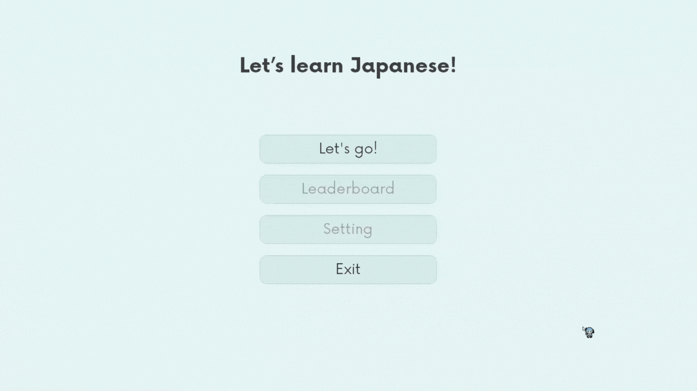

# Japanese learner helper

Japanese learner helper is a program to help you learn Japanese with two courses, 1. Selecting letters and listening to their sounds. 2. typing correct romaji letters from random Japanese character.



---
## Table of Contents

- [Japanese learner helper](#japanese-learner-helper)
  - [Features](#features)
  - [Prerequisites](#prerequisites)
  - [Installation](#installation)
  - [Usage](#usage)
  - [Contributing](#contributing)
    - [Bug Reports and Feature Requests](#bug-reports-and-feature-requests)
    - [Pull Requests](#pull-requests)
  - [Note](#note)
  - [License](#license)
  - [Credits](#credits)

## Features

- **Practice writing and listening** Learn Japanese characters through calligraphy and listen to how they are pronounced.
- **Read and answer** Learn Japanese characters by typing the correct romaji letters from the random Japanese characters.


## Prerequisites

- **Python** Version 3.11. Download it [here](https://www.python.org/downloads/).

## Installation

Follow these steps to install and set up Japanese learner helper.

1. Download the project zip file from GitHub or Clone this repository by typing these in terminal or command prompt (but if you choose to download the project as a zip file you'll also need to extract the zip file).
   ```
   git clone https://github.com/ZeroMirai/Japanese-learner-helper.git
   ```

2. Open a terminal or command prompt and change the directory to the project folder by typing `cd` followed by where this folder is located for example `cd C:\Git_hub\Japanese-learner-helper`.
3. Install all necessary library by typing.
   ```
   pip install -r requirements.txt
   ```
  
## Usage

1. Open `run.bat`.

---
## Contributing

Japanese learner helper is a project created for fun, if you are interested to contribute in this project here is how you can make this project better for everyone.

### Bug Reports and Feature Requests

If you found a bug or have an idea for a new feature, feel free to requests and reports by [open an issue](https://github.com/ZeroMirai/Japanese-learner-helper/issues) on GitHub and post it if it's a bug please give as much detail as possible or suggest an idea please include a step or a clear description.

### Pull Requests

If you have suggestions or improvements.

1. Fork the repository and create your own branch from `main`.
2. Work on your changes.
3. Write clear, concise commit messages that describe the purpose of your changes.
4. Open a pull request and provide a detailed description of your changes.

I'm primarily looking for code improvements and bug fixes. Once your changes are approved, they will be merged into the main project.

### ⭐ Share and Give a Star ⭐

**If you find this project useful I would be really grateful if you could consider sharing this small project with others and giving it a star on GitHub.**

---

## Note

- The program only supports 16:9 size monitors or 1920x1080.
- Press `ESC` to exit full screen.

## License

This project is licensed under the [MIT License](LICENSE).

## Credits

- **CustomTkinter** - Used for frontend creation. For more information, visit [CustomTkinter](https://customtkinter.tomschimansky.com/)
